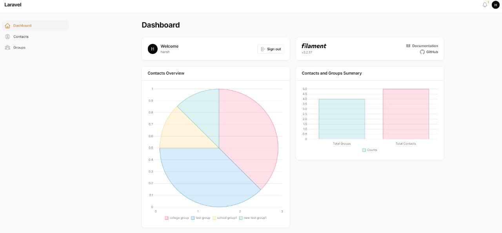

# Laravel Filament Application

This application is built using Laravel Filament and provides functionalities to manage Contacts and Groups with many-to-many relationships. It includes features for importing and exporting data via CSV and generating reports with visualizations.

## Features

1. **Filament Integration**: Utilized Filament for building the application's UI components.
2. **Contacts and Groups CRUD**: Create, Read, Update, and Delete operations for managing contacts and groups, with many-to-many relationships.
3. **CSV Data Import**: Import contact data via CSV.
4. **CSV Data Export**: Export contacts.
5. **Reports**: bar or graph charts for data visualization in dashboard.
6. **SQLite Database**: The application uses an SQLite database for data storage.

## Screenshots

### Dashboard


### Contacts Export Notification


### Contacts


### Groups


### CSV Data Export


### CSV Data Import

## Installation

1. Clone the repository:
    ```bash
    git clone https://github.com/yourusername/your-repository.git
    cd your-repository
    ```

2. Install dependencies:
    ```bash
    composer install
    ```

3. Set up the environment file if any:
    ```bash
    cp .env.example .env
    php artisan key:generate
    ```

4. Configure the SQLite database in your `.env` file if required:
    ```env
    DB_CONNECTION=sqlite
    DB_DATABASE=/absolute/path/to/your/database.sqlite
    ```

5. Run database migrations:
    ```bash
    php artisan migrate
    ```

6. Serve the application:
    ```bash
    php artisan serve
    ```

## Usage

### Contacts and Groups Management

- Navigate to the Contacts section to manage contacts.
- Navigate to the Groups section to manage groups.
- Contacts and Groups have a many-to-many relationship, which can be managed through the contact creation/edit form.

### Data Import via CSV

- Use the import functionality to upload a CSV file containing contact data.
- The CSV should have columns for contact details.

### Data Export via CSV

- Use the export functionality to download a CSV file containing contact data along with group relationships as a single column with comma-separated values.

### Reports

- View reports in the dashboard, where data is visualized using bar or graph charts.

